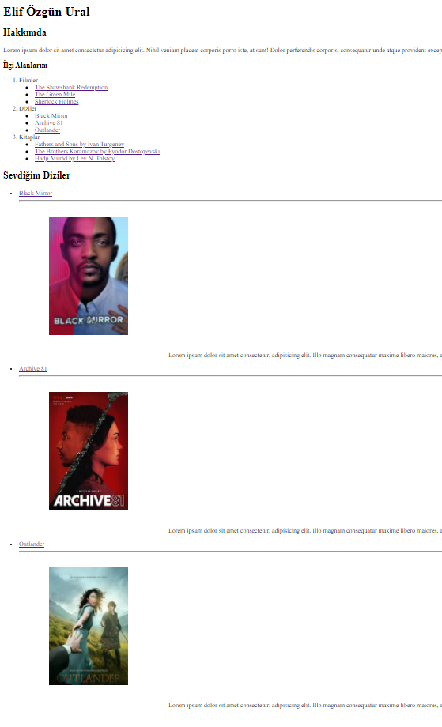

# HTML Ödev 2
index.html sayfasına sevdiğim film, dizi ve kitapları bunlar başlıklar olacak şekilde sıraladım. (Film, dizi, kitap sıralı liste, içerikleri bullet liste olacak şekilde)
Bunları sıralarken film ve dizilere IMDb linki, kitaplara da Goodreads linklerini ekledim.
Tüm film, dizi ve kitaplar için bir adet görsel ve tanıtım metni* ekledim. 
(*) Metinlerde Lorem Ipsum' dan faydalanılmıştır.
Kurduğum yapılarda block, inline gibi elementler kullanmaya çalıştım.

Bu repo [Kodluyoruz](https://www.kodluyoruz.org/) Front-End Eğitim içeriğinin HTML konusunun ikinci ödevidir. 

Proje içerik olarak;

REDAME.md

index.html

resim dosyalarını barındırıyor.

# Installation

Öncelikle projeyi klonlayın. 

[https://github.com/elifzgnrl/kodluyoruz-odev2](https://github.com/elifzgnrl/kodluyoruz-odev2)
  
# Usage
Projeyi klonladıktan sonra Visual Studio Code programında açınız.

Linux için:

cd kodluyoruz-odev2

code .

# Contribution
Pull requestler kabul edilir. Büyük değişiklikler için, lütfen önce neyi değiştirmek istediğinizi tartışmak için bir konu açınız.

# License
[MIT](https://choosealicense.com/licenses/mit/)
